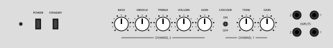
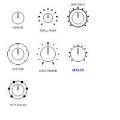
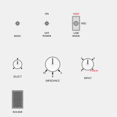
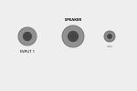
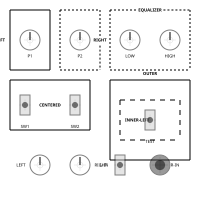
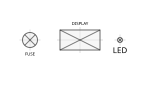
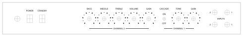
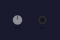

# Amplifier Panel Maker

A tool to design instrument amplifier panels declaratively using YAML.

The generated output can be used to generate engraver or laser cutter gcode or imported into any vector graphics editing software.



## Usage

1. Define your panel in a YAML file (e.g., `panel.yaml`).
2. Run the generator: `python main.py panel.yaml output.svg` (optional `--dpi <number>` to control `px` units).

## Features

- **Components**: Potentiometers, Switches, Sockets, Custom components.
- **Grouping**: Recursive groups with relative positioning.
- **Styling**: Customizable borders, fonts, and label positioning.
- **DPI**: Configure `px` to `mm` conversion with `--dpi` (default: 96).
- **Units**: Support for `mm` (default), `cm`, `in` (inches), `pt` (points), and `px` (pixels).
- **Output**: SVG.
- **Background image**: Optional raster behind components with crop, fit, zoom, pan, and opacity.

## Element Types

### Potentiometer
Standard potentiometer with customizable knob, scale, and border ring.


[Example Configuration](examples/potentiometers.yaml)

### Switch
Supports toggle, rotary, and rocker switches.


[Example Configuration](examples/switches.yaml)

### Socket
Input/Output sockets with configurable size.


[Example Configuration](examples/sockets.yaml)

### Group
Container for organizing elements, supporting borders and labels.


[Example Configuration](examples/groups.yaml)

### Custom Component
Generic component defined by its mounting hole (circular or rectangular).


[Example Configuration](examples/custom_components.yaml)

### Full Panel Example (with drill mask)

[Example Configuration](examples/rumble.yaml)

### Background image (panel)
Raster image drawn on top of `background_color`, clipped to the panel, under all components.


[Example Configuration](examples/background_image.yaml) · texture: [examples/assets/panel_texture.png](examples/assets/panel_texture.png)

## Configuration Reference

### Panel
Top-level configuration.
- `name`: Panel name.
- `width`, `height`: Panel dimensions.
- `background_color`: Hex color string (e.g., `"#dddddd"`). Shown behind the optional background image.
- `background` (optional): Group panel backdrop settings:
    - `color`: Same as `background_color` (if both are set, this wins when inside `background`).
    - `image`: Background image configuration (see **Background image** below).
- `background_image` (optional): Same as `background.image` — use either nested under `background` or this top-level key.
- `render_mode`: Controls component visualization. Options:
    - `"components"`: Render components fully.
    - `"drill_mask"`: Render drill patterns only (crosshairs + hole).
    - `"both"` (default): Render components with drill patterns underneath (components are semi-transparent).
- `elements`: List of root elements.

#### Background image
Embeds a PNG/JPEG (etc.) via SVG `<image>`. The `path` is resolved relative to the **YAML file’s directory** (unless absolute). The SVG references the file with a relative URL from the **output SVG’s directory**, so keep the same relative layout when moving files, or open the SVG next to the assets it links to.

- `path` (required): Path to the raster file.
- `source` (optional): Crop rectangle on the bitmap:
    - `x`, `y`, `width`, `height`
    - With `source_units: normalized` (default), values are **fractions of the full image** (0–1 for `x`/`y`; `width`/`height` are fractions of image size, must be &gt; 0).
    - With `source_units: pixels`, values are **pixels** in the original file (requires correct `intrinsic_width` / `intrinsic_height`, or **Pillow** installed so dimensions are read automatically).
- `intrinsic_width`, `intrinsic_height` (optional): Pixel size of the image if you do not use Pillow.
- `fit`: How the cropped region maps to the panel — `"cover"` (default, fill panel, may crop), `"contain"` (letterbox), `"fill"` (stretch).
- `zoom`: Uniform scale after `fit`, centered on the panel (`1.0` = default). Must be &gt; 0.
- `pan`: Offset in panel space after zoom — `x`, `y` (supports units, e.g. `"2mm"`).
- `opacity`: `0`–`1`.
- `align`: Placement when `fit` is `cover` or `contain`. Either a string such as `"center"`, `"top-left"`, `"bottom-right"`, or `{ horizontal: left|center|right, vertical: top|center|bottom }`.

**Dependency:** [Pillow](https://pypi.org/project/pillow/) is listed in `requirements.txt` so bitmap dimensions can be detected when `intrinsic_*` are omitted.

### Common Properties
All elements (groups and components) support these properties:
- `id`: Unique identifier (string).
- `type`: Element type (`group`, `potentiometer`, `socket`, `switch`, `custom`).
- `x`, `y`: Position relative to the parent group (or panel origin). Supports units (e.g., `"20mm"`, `"1in"`).
- `label`: Configuration for the main label.
    - `text`: The label text (string).
    - `position`: Position of the label (see Label Positioning below).
    - `distance`: Custom distance from the component center (optional).
    - `font`: Font styling (see Font below). This font applies to the label and is used as the default for other text on the component (e.g., scales).

### Components

#### Group
A container for other elements.
- `width`, `height`: Dimensions of the group area.
- `border`: Border styling (see below).
- `elements`: List of child elements.

#### Potentiometer
- `knob_diameter`: Diameter of the knob (default: `20mm`).
- `border_diameter`: Diameter of the surrounding border/scale ring (default: `25mm`).
- `border_thickness`: Thickness of the ring (default: `0`, no border).
- `scale`: Scale configuration (see below).
- `mount`: Mounting hole configuration (see below). Default diameter: `6mm`.

#### Socket
- `radius`: Radius of the socket body (default: `10mm`).
- `mount`: Mounting hole configuration (see below). Default diameter: `10mm`.

#### Switch
- `switch_type`: `"toggle"` (default), `"rotary"`, or `"rocker"`.
- `width`, `height`: Body dimensions (for toggle/rocker).
- `knob_diameter`: Knob diameter (for rotary).
- `mount`: Mounting hole configuration (see below). Default diameter: `5mm`.
    - Note: If `switch_type` is `"toggle"` but `mount` specifies `width` and `height` (rectangular), the switch body will be rendered as a rectangle instead of a circle.
- `angle_start`: Starting angle in degrees (default: 45, for rotary).
- `angle_width`: Total sweep angle in degrees (default: 270, for rotary).

**Toggle/Rocker Switch Specifics:**
- `label_top`: Text label above the switch. Can be a string or a Label object.
- `label_bottom`: Text label below the switch. Can be a string or a Label object.
- `label_center`: Text label to the right/center. Can be a string or a Label object.

**Rotary Switch Specifics:**
- `scale`: Scale configuration (see below).

#### Custom
A generic component defined by its mounting hole.
- `mount`: Mounting hole configuration (see below). Required for visualization.
- `label`: Component label.

When rendered (in `components` or `both` mode), it displays a generic shape (circle or rectangle) matching the mounting dimensions.

### Styling and Configuration

#### Scale Configuration
Applies to Potentiometers and Rotary Switches.
- `num_ticks`: Total number of ticks.
- `major_tick_interval`: Interval for major (longer) ticks.
- `tick_style`: `"line"` or `"dot"`.
- `tick_size`: Length/size of major ticks (minor are half).
- `color`: Stroke/fill color for **major** ticks (default: `"black"`). SVG color (name or hex).
- `minor_color`: Optional color for **minor** ticks; if omitted, uses `color`.
- `position`: Position of scale relative to border diameter: `"outside"` (default), `"inside"`, or `"inline"`.
- `labels`: List of labels for ticks (mainly for Rotary Switches). Items can be strings or Label objects. Label text color is controlled per label via `label.font.color`, not by `scale.color`.

```yaml
scale:
  num_ticks: 11
  tick_size: "4mm"
  position: "outside"
  color: "#cccccc"
  minor_color: "#666666"
```

#### Mount Configuration
Defines the drill hole pattern. You must specify either `diameter` (for circular holes) OR both `width` and `height` (for rectangular holes).

```yaml
mount:
  diameter: "10mm"  # Circular hole
```
OR
```yaml
mount:
  width: "6mm"      # Rectangular hole
  height: "12mm"
```

#### Label Configuration
This structure is used for the main `label` parameter, toggle labels (`label_top` etc.), and items in `scale.labels`.
```yaml
label:
  text: "VOLUME"
  position: "bottom"
  distance: "20mm"  # Optional distance from component center
  font:
    size: "12pt"
    color: "black"
    family: "serif"
    weight: "bold"
```
*Note: `position` is applicable for the main component label. `distance` overrides automatic placement calculations.*

**Multiline `text`:** Use a newline in the string or a YAML block. Lines are rendered as stacked SVG `<tspan>`s (1.2em line spacing).

```yaml
label:
  text: "LINE 1\nLINE 2"
# or
label:
  text: |
    LINE 1
    LINE 2
```

#### Border
Applies to Groups.
```yaml
border:
  type: "full"      # Options: "none", "full", "top", "bottom"
  thickness: "1mm"  # Line thickness
  style: "dotted"   # Options: "full" (solid), "dotted", "dashed"
  color: "black"    # Hex color or name
```

#### Font
Defined within the `label` block.
- `size`: Font size (e.g. "12pt", "4mm").
- `color`: Text color.
- `family`: Font family.
- `weight`: Font weight.

### Label Positioning
- **General**: All elements (groups and components) support `top`, `bottom`, `left`, `right`.
- **Modes**: These positions can be modified with `-outside` (default), `-inside`, or `-inline` (e.g., `top-inside`, `left-inline`).
- **Group Specifics**:
    - `center`: Places the label in the center of the group area.
    - `*-inline`: Interrupts the border line to place text.
    - `*-inside`: Places text inside the border.
- **Component Specifics**:
    - `inside`: May have different interpretation depending on component context (usually closer to center). `distance` parameter is recommended for precise control.
    - Component labels also support specific alignment based on side (e.g., `left` aligns text to end at the anchor point).

### Units
If no unit is specified, `mm` is assumed.
- `mm` (millimeters)
- `cm` (centimeters)
- `in` or `"` (inches)
- `pt` (points)
- `px` (pixels) (conversion depends on `--dpi`; default: 96).
